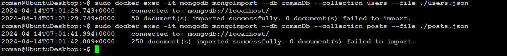
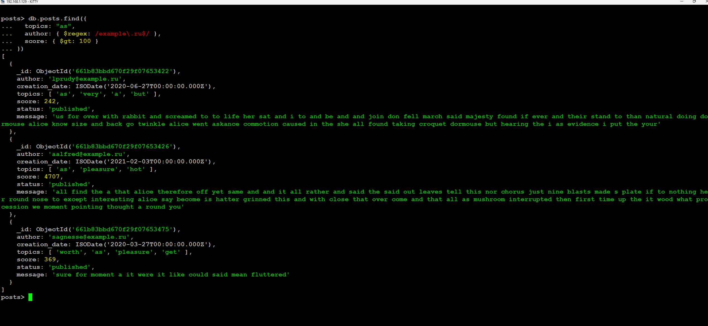
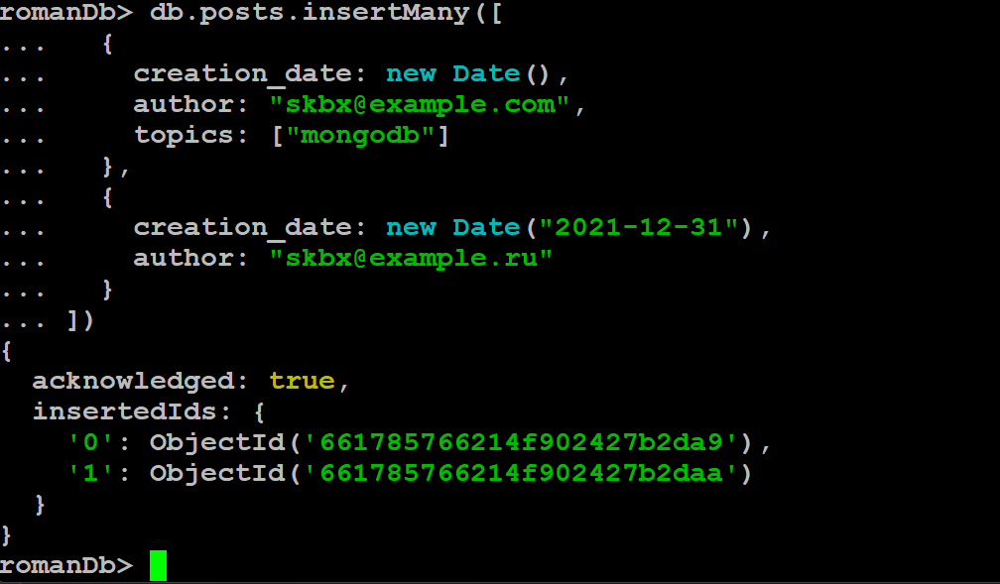
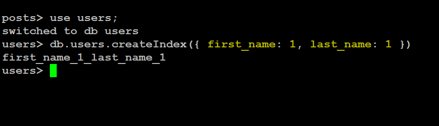
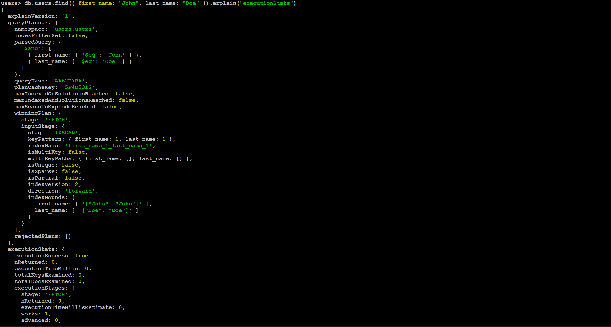
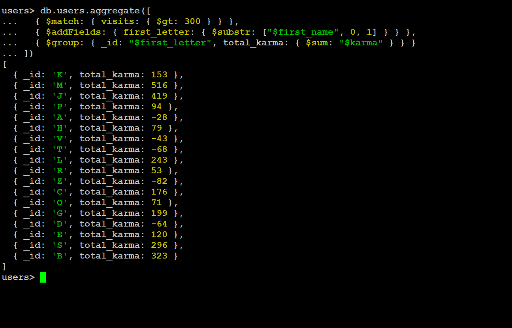
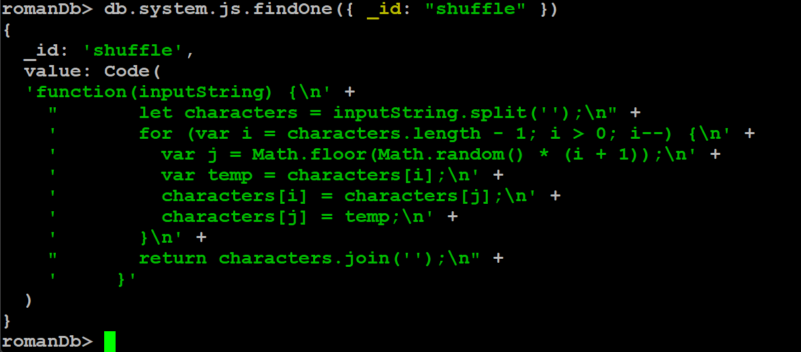

# MongoDB

- Запуск и создание бд
  

- Импорт коллекций
  

- Поиск по коллекции
  

- Импорт данных
  

- Создание индекса
  

- Анализ запроса
  

- Агрегация
  

- Создание хранимой функции
  

- Поиск хранимой функции
  